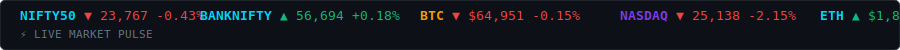
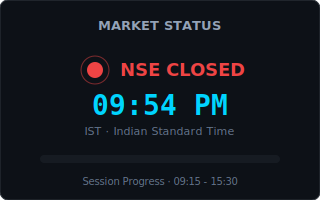
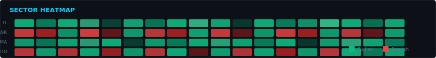

<div align="center">

<!-- Animated cyber + trading banner -->


<!-- Typing animation -->
[](https://git.io/typing-svg)

<!-- Social badges -->
[](https://linkedin.com/in/chiragverma00310)
[](https://CVsiouy.vercel.app)
[](mailto:chiragverma00310@gmail.com)
[](https://leetcode.com/u/chiragverma00310)
[](https://twitter.com/CVsiouy)

</div>

---

## 👨‍💻 About Me

```csharp
public class ChiragVerma : IEngineer, IQuant, IBuilder
{
    public string[] Roles       => ["Software Engineer", "Quant Trader", "AI Developer", "Game Dev"];
    public string[] CoreStack   => [".NET", "C#", "Azure", "Python", "SQL"];
    public string[] Focus       => ["Trading Systems", "AI Agents", "Cloud Architecture", "Backtesting"];
    public bool     AlwaysLearning => true;
}
```

> I'm a **Software Engineer** who builds robust systems in **.NET & Azure**, trades the markets with **discipline and data**, and explores **Agentic AI** — from RAG pipelines to MCP-powered automation. I believe in learning deeply, shipping consistently, and treating every commit like a trade: **risk-managed, intentional, and measured.**

---

## 🤖 AI & Cloud

<div align="center">


</div>

**Currently Exploring:** Agentic AI · LangGraph · Azure AI Foundry · MCP Servers · Vector DBs · Fine-tuning

---

## ⚡ Tech Stack

### Languages


### Frameworks & Tools


### Skill Icons Grid
<div align="center">

</div>

---

## 📈 Live Market Pulse

<!-- Animated scrolling ticker -->


<!-- Market status + animated candlestick -->
<table>
<tr>
<td width="50%" align="center">

**Market Status**



</td>
<td width="50%" align="center">

**Live Candlestick**



</td>
</tr>
</table>

<!-- Sector heatmap -->


---

## 🚀 Currently Building

| Project | Stack | Status |
|---------|-------|--------|
| **Quant Trading Platform** | C# · Python · Azure | 🟢 Active |
| **AI Agent Framework** | Semantic Kernel · MCP · RAG | 🟢 Active |
| **Backtesting Engine** | .NET · SQL · Indicators | 🟡 In Progress |
| **Game Engine** | C# · Graphics | 🔵 Exploring |

---

<!--
## 📊 Developer Dashboard

<div align="center">

- GitHub Stats


- GitHub Streak 


- Top Languages 


</div>

- GitHub Metrics (richer than basic stats)
<!-- 
<div align="center">

</div>

<div align="center">


</div> 
-->


---

<!-- Leetcode Section-->
<div align="center">

</div>

<!-- #### Trading Strategy Engineering Pipeline
```mermaid
graph LR
   Idea[Strategy Idea] - Backtest[Backtest Engine]
   Backtest - Evaluate[Risk/Reward Evaluation]
   Evaluate - Fails| Idea
   Evaluate - Passes| Paper[Paper Trading Signal]
   Paper - Live[Live Deploy: Azure AI Agent]
``` 
(replace - with below sign)
-->


---

## 💹 Trading Experience

<table>
<tr>
<td width="55%">

### Strategy Arsenal

```
✔ EMA Crossover          ✔ VWAP Reversion
✔ Opening Range Breakout ✔ Liquidity Grab / ICT
✔ Volume Profile         ✔ Statistical Arbitrage
✔ Price Action           ✔ Order Flow Analysis
```

### Indicators I Use


</td>
<td width="45%">

### Skill Matrix



</td>
</tr>
</table>

### Trading Journey

```
2022 ──► Started learning markets & price action
   │
2023 ──► Built Python backtesting engine
   │
2024 ──► Paper trading + risk management frameworks
   │
2025 ──► Quant strategies in C# + Azure data pipelines
   │
 NOW ──► AI-assisted trading signals & agent automation
```

### Today's Trading Quote

> *"The market rewards discipline, not intelligence."* — Jesse Livermore

<!-- Random quote on each refresh -->


---

## 👾 Pac-Man Contribution Graph

<!-- Requires GitHub Action — see .github/workflows/pacman-contribution.yml -->
<!-- After first workflow run, this image will appear automatically -->

<picture>
  <source media="(prefers-color-scheme: dark)" srcset="https://raw.githubusercontent.com/CVsiouy/CVsiouy/output/pacman-contribution-graph-dark.svg">
  <source media="(prefers-color-scheme: light)" srcset="https://raw.githubusercontent.com/CVsiouy/CVsiouy/output/pacman-contribution-graph.svg">
  
</picture>

<!-- Bonus: Galaga contribution graph (uncomment after enabling in workflow) -->
<!--
<picture>
  <source media="(prefers-color-scheme: dark)" srcset="https://raw.githubusercontent.com/CVsiouy/CVsiouy/output/galaga-contribution-graph-dark.svg">
  
</picture>
-->

---

<!--
## ☁ Azure Certifications

<!-- Add your cert badges here as you earn them 


<!--  
---
-->

<!--
## 🏆 Achievements & Activity

<div align="center">

# Trophy


# Activity Graph


</div>

---
-->

<!--
## 📖 Latest Blog Posts

- Replace with your blog RSS feed URL 
- pip install github-readme-blog-posts-action OR use manual links 

- 📝 [Building a Quant Backtesting Engine in C#](#)
- 📝 [Azure AI Agents with Semantic Kernel & MCP](#)
- 📝 [Price Action Patterns That Actually Work](#)
- 📝 [From LeetCode to Production: Algorithm Patterns in Trading](#)

<!-- Auto-fetch from dev.to (uncomment and set username):
https://dev.to/api/articles?username=YOUR_DEVTO_USERNAME

---
-->

<!--
## 🎵 Now Playing

- Replace YOUR_SPOTIFY_ID — get from spotify-now-playing-creator 
[](https://open.spotify.com/user/YOUR_SPOTIFY_ID)

---
-->

<!--
## 📫 Let's Connect

<div align="center">

[](https://github.com/ChiragVerma)
[](https://CVsiouy.vercel.app)
[](mailto:chiragverma00310@gmail.com)
[](https://linkedin.com/in/chiragverma00310)
[](https://leetcode.com/u/chiragverma00310)
[](https://twitter.com/CVsiouy)

</div>

---
-->

<div align="center">

<!-- Visitor counter (resized to h2 & img height=38 for high visibility) -->
<h2></h2>

<!-- Footer wave -->


**Thanks for visiting!** If you like quant systems, clean architecture, or Pac-Man eating green squares — let's connect. 🚀

</div>
